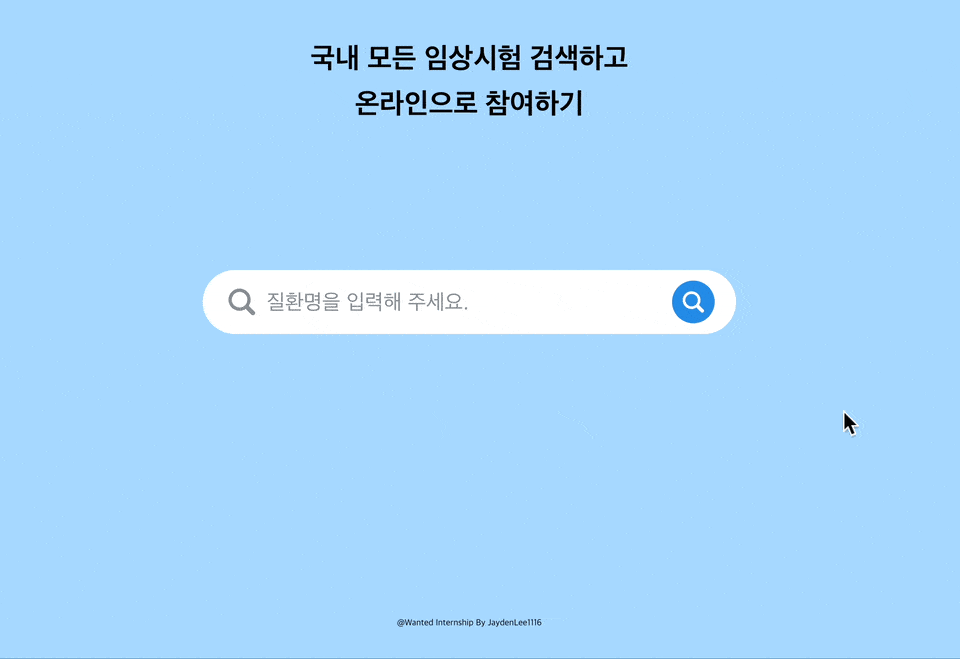

# 원티드 프리온보딩 인턴십 프론트엔드 과제 - Week 3

## 🔨 이름: 이재호

## 🔨 프로젝트 실행 방법

### 1. Git clone 및 폴더 이동

[제이든 - 원티드 프리온보딩 인턴십 프론트엔드 사전과제 repo](https://github.com/JaydenLee1116/wanted-internship-w3)로 이동하여 `clone` 합니다.

```shell
# Code - HTTPS clone 예시
git clone https://github.com/JaydenLee1116/wanted-internship-w3.git
# 폴더 이동
cd wanted-internship-w3
```

### 2. 패키지 설치 및 실행

```shell
# 패키지 설치
npm install
# 실행
npm start
```

> 🔑 참고: MSW를 사용하여 `http://localhost:4000`에서 API를 제공합니다. 따로 서버를 실행할 필요없이 위의 과정대로 `npm start`를 실행하면 됩니다.

## 🔨 프로젝트 구현 핵심 내용

### 1. API 호출에 대한 캐싱 처리 + expired time 설정

1. cache와 cache를 update하기 위한 함수를 분리하고 각각을 Context API를 사용하여 전역에서 공유토록 하였습니다.
2. 이 때, cache는 `Map`을 사용하여 key-value 형태로 저장하였습니다.
   1. 프로젝트 특성상, 검색어에 따른 GET 요청만 존재하여, 쿼리 파라미터인 `검색어`를 key로 하고 응답받은 데이터를 value로 하였습니다.
3. 또한, cache는 직접적으로 UI 렌더링과 관련되지 않으면서 그 값을 유지해야하므로 `useRef`를 사용하여 저장하였습니다.
4. updateCache 함수의 인자로 `expired time`을 받고, 이를 `setTimeout`과 Map의 `delete` 메서드를 사용하여 주어진 시간 이후에 cache를 삭제하도록 하여 stale cache를 방지하였습니다.

CacheContext.tsx

```tsx
import React, { useRef } from 'react';

import { createContext, useContext } from 'react';

const CacheContext = createContext<any>(null);
const CacheChangeContext = createContext<any>(null);

export const useCache = () => useContext(CacheContext);
export const useCacheChange = () => useContext(CacheChangeContext);

interface CacheProviderProps {
  children: React.ReactNode;
}

export const CacheProvider = ({ children }: CacheProviderProps) => {
  const cacheRef = useRef(new Map());

  const updateCache = (key: any, value: any, expiredTime: number) => {
    cacheRef.current.set(key, value);
    setTimeout(() => {
      cacheRef.current.delete(key);
    }, expiredTime);
  };

  return (
    <CacheContext.Provider value={cacheRef}>
      <CacheChangeContext.Provider value={updateCache}>{children}</CacheChangeContext.Provider>
    </CacheContext.Provider>
  );
};
```

App.tsx

```tsx
function App() {
  return (
    <>
      <GlobalStyles />
      <ThemeProvider theme={theme}>
        <CacheProvider>
          {' '}
          // CacheProvider를 최상위 컴포넌트로 두어 전역에서 공유
          <RouterProvider router={router} />
        </CacheProvider>
      </ThemeProvider>
    </>
  );
}

export default App;
```

> 참고: `/src/context/CacheContext`와 `/src/hooks/useGetQuery`

### 2. 검색어 입력마다 API가 호출되지 않도록 debounce 처리

1. 처음엔 utils 폴더에 debounce 함수를 구현하여 debounce 역할만 하는 함수를 만들고 이를 `useGetQuery` 함수에서 사용하려고 하였습니다.
2. 하지만 useGetQuery내의 getData 함수 자체가 useGetQuery에서 선언한 [data, setData]에 의존하고 있기에 debounce 함수를 따로 만들어 사용할 수 없었습니다.
3. 고민하던 중, `useGetQuery` 함수 자체에서 캐싱되지 않고 api 요청으로 넘어가는 경우에만 getData 함수에 대해 useEffect의 cleanup 함수를 통해 debounce 처리하는 로직으로 구현하였습니다.

> 참고: `/src/hooks/useGetQuery` (아래는 해당 부분의 코드입니다.)

```ts
const timeOutId = setTimeout(async () => {
  await getData();
}, DEBOUNCE_DELAY);

return () => {
  clearTimeout(timeOutId);
};
```

### 3. 키보드만으로 추천 검색어 이동

1. [아이디어 1]. 상위 컴포넌트인 SearchPage 컴포넌트에서 `focusIndex` 상태를 두어, 키 이벤트에 대해 값을 -1, +1을 해주었습니다. 해당 값을 SearchKeywordList 컴포넌트에 전달하고 Item들의 배열에 대해 map 함수를 사용하여 Item의 index와 focusIndex값을 비교하여 boolean 값을 전달하였습니다. 이를 통해 true인 Item에 대해서만 background-color을 변경시키는 방식으로 마치 focus된 것처럼 보이도록 하였습니다.
   1. (단점) 1번의 아이디어는 눈으로 보이기에만 선택된 것처럼 보여서 이후 키보드 이벤트를 처리하기 까다로웠습니다.
2. [아이디어 2.] 상위 컴포넌트인 SearchPage 컴포넌트에서 element를 담는 배열을 useRef로 두고 이를 직접 각각의 keywordItem에 전달하여 실제로 해당 엘리먼트를 가져오는 방식을 사용했습니다. 이를 통해 실제 element를 선택하여 focus 이벤트에 따른 다양한 처리를 쉽게 해줄 수 있었습니다.

## 🔨 프로젝트 데모



1. 검색어 입력 시, API를 호출하여 추천 검색어를 확인할 수 있습니다.
2. 한 번 검색한 검색어는 캐싱되어, 다시 검색할 때 API를 호출하지 않으며 즉각적인 UI를 보여줍니다.
3. 검색바에서 키보드 방향키를 통해 추천 검색어를 선택하고 엔터키를 통해 최근 검색어로 저장할 수 있습니다.

감사합니다. 🥳
